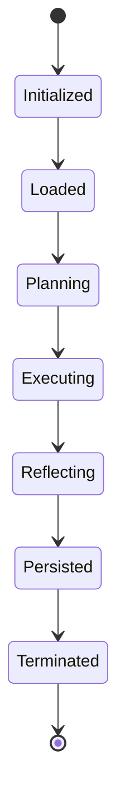

# Agent State Lifecycle

This document outlines the full lifecycle of agents within the Forgeborn system, including transitions, responsibilities, and persistence expectations.

---

## Lifecycle Overview

Agents in Forgeborn operate in a stateful loop. The core lifecycle phases are:

1. **Initialized**
2. **Loaded**
3. **Planning**
4. **Executing**
5. **Reflecting**
6. **Persisted**
7. **Terminated**

---

## 1. Initialized

- Agent module is instantiated.
- Required configuration and metadata are loaded.
- Dependency checks are validated (e.g., skills, API keys, runtime context).

```ts
state = 'initialized'
```

---

## 2. Loaded

- Context, memory embeddings, or planning blueprints are injected.
- The agent logs readiness and publishes an entry in `agent_runs`.

```ts
state = 'loaded'
```

---

## 3. Planning

- Agent evaluates its blueprint, execution plan, or goals.
- Determines which skills and resources are needed.
- Logs decisions to `planning_log`.

```ts
state = 'planning'
```

---

## 4. Executing

- Agent invokes its skill chain using the runtime engine.
- Execution traces are generated and logged to `execution_trace.yaml`.
- Failures are caught, wrapped in stateful errors, and retried or escalated.

```ts
state = 'executing'
```

---

## 5. Reflecting

- Results are reviewed against the original goal.
- `reflection_agent_v1` may summarize success/failure patterns.
- Insights are persisted to `reflection_summary.yaml` and Supabase if enabled.

```ts
state = 'reflecting'
```

---

## 6. Persisted

- Agent updates the `long_term_memory.json`, blueprint registry, and optionally Supabase tables (`agent_runs`, `llm_logs`, etc.).
- Provenance data is tagged with `rc_id`, timestamps, and agent hashes.

```ts
state = 'persisted'
```

---

## 7. Terminated

- Final log entries are flushed.
- Memory and state are released unless `--persistent` flag is used.

```ts
state = 'terminated'
```

---

## Transition Diagram (Simplified)



---

## Notes

- Each agent must write an `agent_run_log.yaml` containing all lifecycle state transitions.
- Debug mode will dump the state transition trace to the console.
- Invalid transitions raise `LifecycleTransitionError`.

---

## Future Enhancements

- Lifecycle hooks for pre- and post-skill execution.
- Audit logging integration with a Supabase `agent_lifecycle_events` table.
- Visualization of agent cycles in the dashboard frontend.