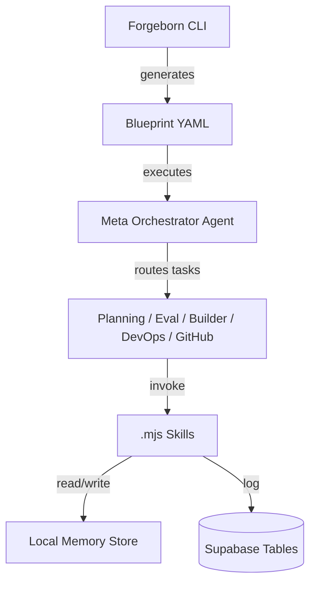

# Forgeborn Data Flow Specification

This document describes the core data flow architecture in the Forgeborn project. It outlines how data moves between agents, skills, blueprints, memory layers, and external systems like Supabase.

---

## 1. System Components

### Agents
Agents are autonomous modules that execute tasks based on blueprints. They interact with memory, skills, and external APIs.

### Skills
Reusable functional units invoked by agents for performing specific operations (e.g., generate code, validate plans, push to GitHub).

### Blueprints
YAML-based plans defining the logic and execution structure for agents.

### Memory System
Structured file-based and Supabase-backed memory for long-term traceability, planning, logs, and embedded vector search.

### Supabase
Used for persistence of structured logs, RC plans, reflections, and vector embeddings.

---

## 2. Data Flow Overview

---

## 3. Sequence Example: RC Code Generation

1. **User runs `plan` command** → generates a YAML blueprint.
2. **Orchestrator** loads the blueprint and identifies required agents.
3. **Planning Agent** creates a planning file and logs to memory + Supabase.
4. **Builder Agent** uses `generate_code_from_spec` and `use_llm_adapter` skills to build `.mjs` files.
5. **Evaluator Agent** scores generated output.
6. **GitHub Agent** runs PR creation skills, pushes commits.
7. **All activities** are logged to `forgeborn.llm_logs` and persisted in memory files.

---

## 4. Supabase Data Flow

| Source | Destination | Purpose |
|--------|-------------|---------|
| Agents | `forgeborn.llm_logs` | Logging LLM call metadata |
| Reflection Agent | `forgeborn.reflections` | Persisted RC insights |
| Memory Agent | `forgeborn.memory_chunks` | Embedded vectors for long-term RC memory |
| GitHub Agent | `forgeborn.agent_runs` | PR + code push outcomes |
| Planner | `forgeborn.blueprints` | RC blueprint capture |

---

## 5. Future Enhancements

- Add Redis or Postgres pub/sub for real-time trace streaming.
- Integrate D3 graph service for live data visualization of agent activity.
- API-layer for LLM-based querying of historical memory.

