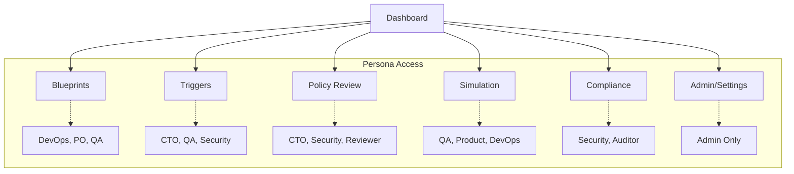
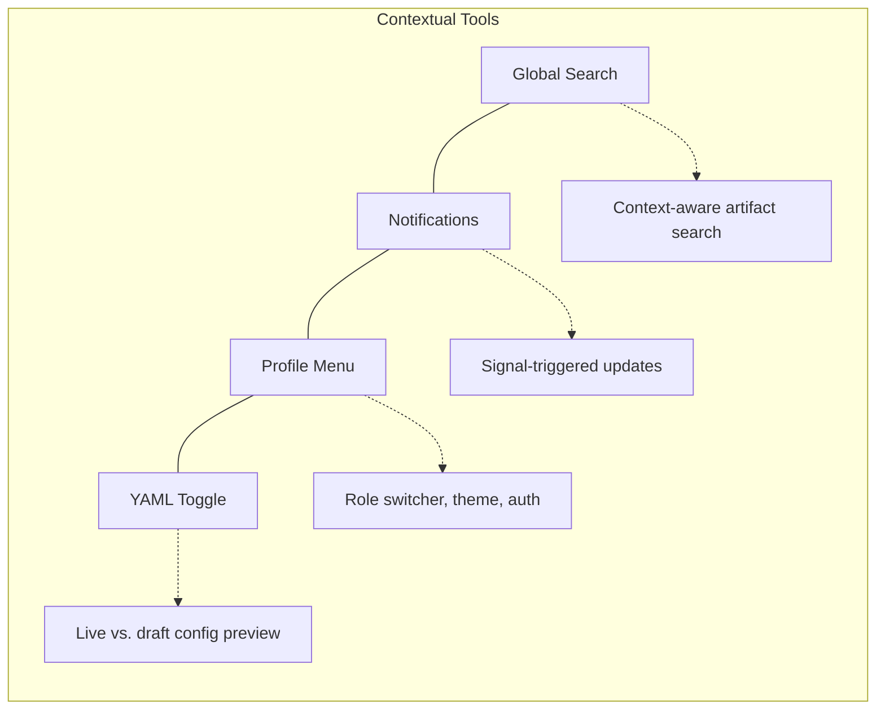
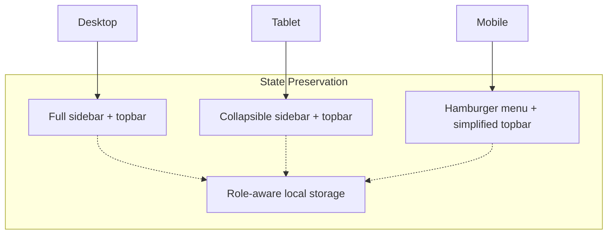
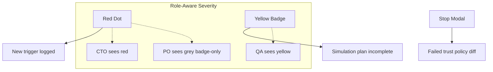

# Phase 19: UADL UI Staging & Navigation Plan

**Project:** Forgeborn – AI-Native Software Factory  
**Phase:** 19 - UADL UI Staging + Navigation  
**Generated:** 2025-04-19  
**Status:** Planning  

---

## 🎯 Overview

This document presents the visual navigation plan for Phase 19 of the Forgeborn project, focusing on UADL UI staging and navigation implementation. It provides a comprehensive view of the planned UI structure, navigation flows, and component relationships.

---

## 🧭 Navigation Structure

The Forgeborn UI navigation is organized around the UADL (Unified Autonomous Delivery Loop) stages, with persona-aware routing that ensures each user role sees only the relevant sections.

### Primary Navigation Groups

| Group ID | Label | Route | Visibility |
|----------|-------|-------|------------|
| `home` | Dashboard | `/dashboard` | All roles |
| `explore` | Blueprints | `/blueprints` | DevOps, PO, QA |
| `governance` | Triggers | `/triggers` | CTO, QA, Security |
| `governance` | Policy Review | `/policy` | CTO, Security, Reviewer |
| `review` | Simulation | `/simulation` | QA, Product, DevOps |
| `audit` | Compliance | `/compliance` | Security, Auditor |
| `system` | Admin / Settings | `/settings` | Admin-only |

---

## 🔝 Topbar Elements

The topbar provides global functionality and contextual tools across all pages:

---

## 🧩 UADL Stage to UI Context Mapping

Each UADL stage has specific UI contexts that support its workflow:

```mermaid
graph TD
    Ideate[Ideate] --> Draft["Blueprint drafts"]
    Ideate --> Templates["Simulation plan templates"]
    
    Plan[Plan] --> Register["Blueprint registration"]
    Plan --> Tier["Tier selection"]
    Plan --> Signals["Signal targets"]
    
    Build[Build] --> Logs["Agent execution logs"]
    Build --> Coverage["Test coverage viewer"]
    Build --> Scoring["Scoring preview tools"]
    
    Validate[Validate] --> Outcomes["Simulation outcomes"]
    Validate --> Matrix["Fallback matrix"]
    Validate --> Diff["Alignment/diff visualizers"]
    
    Deploy[Deploy] --> CI["CI badge view"]
    Deploy --> Approvals["Commit approvals"]
    Deploy --> Rollback["Rollback visibility"]
    
    Monitor[Monitor] --> Timeline["Dashboard timeline"]
    Monitor --> Volatility["Trust score volatility"]
    Monitor --> Override["Override fatigue tracker"]
```

---

## 📱 Responsive Behavior

The UI adapts to different screen sizes with these patterns:

---

## 🧠 Persona-Based Routing

Routes are dynamically filtered based on user persona:

```mermaid
graph TD
    CTO[CTO] --> Dashboard
    CTO --> Triggers
    CTO --> Policy
    CTO --> Settings
    
    QA[QA Lead] --> Dashboard
    QA --> Triggers
    QA --> Simulation
    QA --> Blueprints
    
    DevOps[DevOps] --> Dashboard
    DevOps --> Blueprints
    DevOps --> Simulation
    
    PO[Product Owner] --> Dashboard
    PO --> Blueprints
    PO --> SimReadOnly["Simulation (read-only)"]
    PO --> TrigReadOnly["Triggers (read-only)"]
    
    Security[Security Officer] --> Dashboard
    Security --> Triggers
    Security --> Policy
    Security --> Compliance
    Security --> Settings
    
    Auditor[Auditor] --> Dashboard
    Auditor --> Compliance
    Auditor --> PolicyRead["Policy (read-only)"]
    
    Reviewer[Reviewer] --> Dashboard
    Reviewer --> Policy
    Reviewer --> TrigAssigned["Triggers (as assigned)"]
```

---

## 🧩 Component Usage by Route

Key components and their usage across routes:

| Component | Routes | Dependency |
|-----------|--------|------------|
| TriggerTile | `/triggers`, `/dashboard` | trigger_log.yaml |
| BlueprintScoreCard | `/blueprints`, `/dashboard` | blueprint_enforcement_summary.yaml |
| ReviewerApprovalModal | `/policy`, `/triggers` | reviewer_action_report.yaml |
| SettingsFormLayout | `/settings` | None |

---

## 🚦 Alert & Notification System

Visual indicators for trust governance state:

---

## 📋 Implementation Plan

1. Create route structure and navigation components
2. Implement persona-based visibility filters
3. Develop topbar with contextual tools
4. Build responsive layout variations
5. Connect alert and notification system
6. Implement state preservation

---

## ⚠️ Known Dependencies

- Must reference artifact schemas from `/config/` for component data binding
- Requires `frontend/catalyst-ui-kit/` Tailwind components
- Will need integration with auth system for persona detection
- YAML toggle requires backend API integration

---

## 🔍 Next Steps

- Detail each route's component composition
- Define exact data requirements for each panel
- Create component storybook entries
- Develop prototype route transitions
